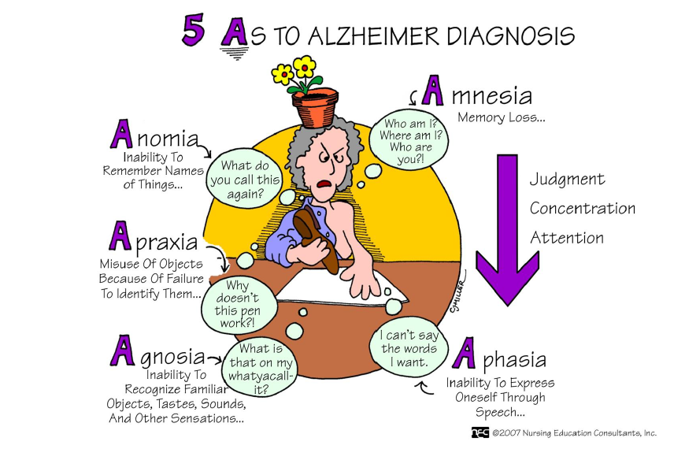

# NA TROPIE ALZHEIMERA
## *neuroobrazowe poszlaki zbrodni*



####Możliwości obrazowania w diagnostyce choroby Alzheimera

1. **Badanie zmian strukturalnych**
    + TK
    + MRI
2. **Badanie perfuzji/metabolizmu glukozy**
    + SPECT
    + PET

### Case #1


1. Atrofia hipokampa i zakrętu przyhipokampowego w przedniej części płata skroniowego

2. Powiększenie komór

### Case #2


Widoczna atrofia w obrębie przedklinka. Łagodny zanik czołowo-ciemieniowy oraz subtelna atrofia hipokampa


Hipometabolizm tylny z dominacją czołowo-ciemieniową prawej półkuli oraz obustronnie w przedklinku.

### Case #3


Obrazy FDG PET-TK wykazują zmniejszoną aktywność metaboliczną w korze ciemieniowo-skroniowej.

### Case #4


1. Globalna atrofia korowa ze ścieńczeniem warstwy istoty szarej.
2. Większa atrofia obserwowana w prawej półkuli a zwłaszcza w bruździe ciemieniowo-potylicznej oraz płacie potylicznym.
3. Łagodny zanik hipokampa.

### Case #5


Badanie perfuzji z 99mTC-ECD ujawnia obustronnąciemieniowo-potylicznąhipoperfuzję.

|Numer Case'u|Diagnoza|
|---|---|
|1| Alzheimer|
|2| Choroba Alzheimera wraz z apraksją|
|3| Alzheimer|
|4| Choroba Alzheimera wraz z [syndromem Gerstmanna](https://youtu.be/vGr8Nbh0Qyw) oraz apraksją|
|5| Alzheimer|

### Traktografia MRI w chorobie Alzheimera


W chorobie Alzheimera najwcześniej demielinizacji ulegaja istota biała płata skroniowego, a zwłaszcza pęczek podłużny dolny.


```
ifelse(1:90 > 65, "możliwy Alzheimer", "brak choroby")
```
**Bibliografia**

1. http://www.nursinged.com
2. https://radiopaedia.org/cases/alzheimer-disease-ct-only
3. https://radiopaedia.org/cases/alzheimers-disease-with-apraxia
4. https://radiopaedia.org/cases/alzheimer-disease-pet-ct
5. https://radiopaedia.org/cases/alzheimers-disease-with-gerstmann-syndrome-and-dressing-apraxia
6. https://radiopaedia.org/cases/alzheimer-disease-on-spect
7. https://www.ncbi.nlm.nih.gov/pmc/articles/PMC4959429/
8. https://www.nik.gov.pl/aktualnosci/nik-o-opiece-nad-chorymi-na-alzheimera.html 

### Chunki

```{r include=FALSE}
library(ggplot2)

ggplot(diamonds)+
 geom_point(aes(carat, price))
```

```{r}
library(readxl)
alzheimer <- read_excel("alzheimer.xlsx")

ggplot(alzheimer)+
  geom_point(aes(wiek, zachorowania), col="blue")
```

```{r}
library(knitr)
kable(mtcars[1:5], caption = "a knitr kable")
```

```{r echo=FALSE, message=FALSE}
ggplot(data=diamonds, aes(carat))+
  geom_histogram(col="blue", fill="green")
```


